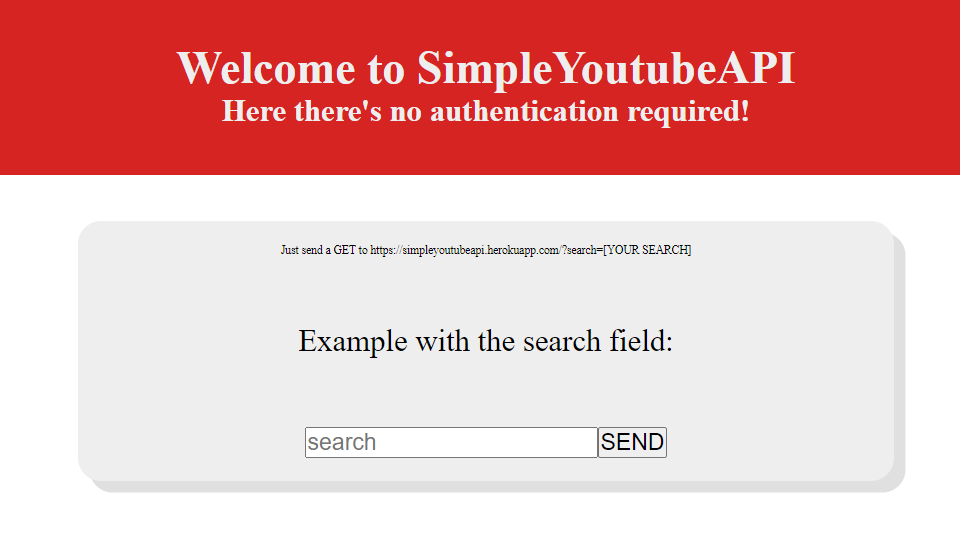

[live-demo-url]: https://simpleyoutubeapi.herokuapp.com/

    

<h1 align="center">
    SimpleYoutubeAPI
</h1>

## :memo: Descrição
Here there's no authentication required!

## :rocket: Como usar
Just send a GET to https://simpleyoutubeapi.herokuapp.com/?search=[YOUR SEARCH]&nresults=[NUMBER OF RESULTS].
Or access: [LINK][live-demo-url]

## :gear: Processo
### :zap: Motivação:
O projeto de api foi feito para treinar as habilidades de web scraping, além de fornecer os dados para uma aplicação de músicas que eu estou trabalhando.
